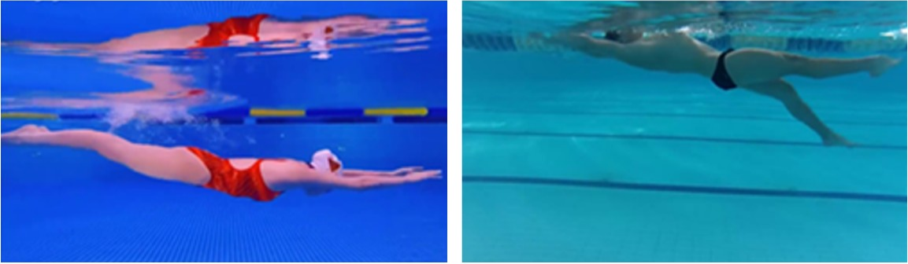
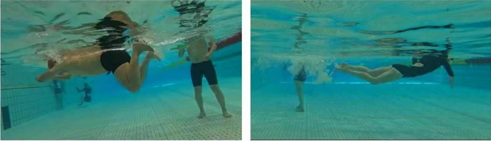
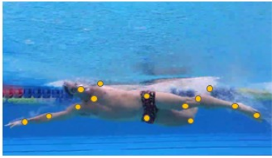
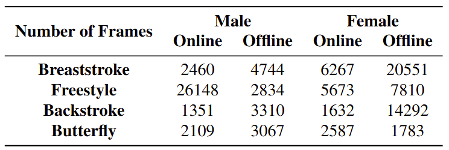

# A Large Scale Annotated Dataset For 2D Human Pose Estimation In Underwater Scenes
Dataset repository for the paper: **A Large Scale Annotated Dataset and Efficient Method for 2D Human Pose Estimation in Underwater Scenes** **(insert author list)**

**(insert paper link on arXiv)**

## Introduction
A `100K` scale annotated dataset for human pose estimation in underwater scenes, containing 94 image sequences (frames from videos of swimming) of `male` and `female` swimmers, covering a variety of swimming strokes(`breaststroke`, `freestyle`, `backstroke` and `butterfly`) as well as external environment factors like light condition and water quality.

## Structures
The main folder `dataset` contains 94 subfolders named from `1` to `94`. Each folder contains two zip files 'images'(video frames of swimming, each of them in `jpg` or `png` format) and 'annots'(information about `18 keypoints` and `bounding box` of swimmers' body, each of them in `json` file format) 

```
dataset/
|--1/
|  |--images.zip
|  |--annots.zip
|--2/
|...
|--94/
```
Each `json` file contains following parts:

```json
{
    "filename": "path to related image file",
    "height": in pixels,
    "width": in pixels,
    "scaleratio": scale ratio of related image file,
    "annots": [
        {
            "personID": always 0(since we focus on single swimmer's pose),
            "bbox": [
                x coordinate of up left dot,
                y coordinate of up left dot,
                x coordinate of down right dot,
                y coordinate of down right dot
            ],
            "keypoints": [
                [
                    x coordinate of keypoint 0(nose),
                    y coordinate of keypoint 0(nose),
                    visibility of keypoint 0(nose)(1.0 denotes "visible" while 0.0 denotes "invisible", which means occluded by water surface)
                ],
                [
                    x coordinate of keypoint 1(neck),
                    y coordinate of keypoint 1(neck),
                    visibility of keypoint 1(neck)(1.0 denotes "visible" while 0.0 denotes "invisible", which means occluded by water surface)
                ],
                ... ...
                [
                    x coordinate of keypoint 17(right finger),
                    y coordinate of keypoint 17(right finger),
                    visibility of keypoint 17(right finger)(1.0 denotes "visible" while 0.0 denotes "invisible", which means occluded by water surface)
                ]
            ]
        }
    ],
    "detect_feet": true or false,
    "isKeyframe": true or false
}
```

## Setup
We use both **online** and **offline** data collection methods, and the sample images collected are shown below. At the level of **network collection**, we obtain relevant public data, most of which are videos of professional athletes competing and teaching, including relatively standard various swimming strokes. At the **offline acquisition** level, we use two *Go Pro* waterproof cameras to capture videos of ordinary people swimming in an indoor swimming pool. 

**Sample data collected online**



**Sample data collected offline**



## Annotations
In order to help determine the swimming style and improve the prediction accuracy, we add the finger and toe keypoints on both sides to **MS COCO** keypoints format, which means ends of middle fingers of both hands and ends of middle toes of both feet. At the same time, we also remove four redundant keypoints, eyes and ears of both sides, which do not contribute much to the pose estimation task. The scope of annotation is limited to the visible keypoints in the image, and the invisible ones (occluded by water) are not annotated to reduce the impact of noise on model training. At the same time, to ensure the high accuracy of object detection, we manually label the detection boxes for training object detectors.

**Skeleton for annotation**


**List of keypoints in our annotation strategy**

| ID | Name | ID | Name | ID | Name |
|----|------|----|------|----|------|
|  0 | nose | 6  | left_elbow | 12 | left_knee |
|  1 | neck | 7  | left_wrist | 13 | left_ankle |
|  2 | right_shoulder | 8 | right_hip | 14 | left_toe |
|  3 | right_elbow | 9 | right_knee | 15 | right_toe |
|  4 | right_wrist | 10 | right_ankle | 16 | left_finger |
|  5 | left_shoulder | 11 | left_hip | 17 | right_finger |

**Sample annotated image in our dataset**



## Statistics
Here we make a detailed information list about swimmer's gender, length, swimming stroke and source of each image sequence. 

| Name | Number of Frames | Swimming Stroke | Gender | Source |
|------|------------------|-----------------|--------|--------|
| 1 | 192 | breaststroke | female | online |
| 2 | 4755 | freestyle | male | online |
| 3 | 1898 | freestyle | male | online |
| 4 | 1992 | freestyle | male | online |
| 5 | 4123 | freestyle | male | online |
| 6 | 3990 | freestyle | male | online |
| 7 | 662 | breaststroke | female | online |
| 8 | 711 | backstroke | female | online |
| 9 | 631 | breaststroke | female | online |
| 10 | 469 | breaststroke | female | online |
| 11 | 294 | butterfly | female | online |
| 12 | 302 | butterfly | female | online |
| 13 | 297 | butterfly | female | online |
| 14 | 519 | freestyle | male | online |
| 15 | 282 | unknown* | male | online |
| 16 | 272 | unknown* | male | online |
| 17 | 293 | butterfly | male | online |
| 18 | 344 | butterfly | male | online |
| 19 | 501 | butterfly | male | online |
| 20 | 511 | butterfly | female | online |
| 21 | 609 | breaststroke | female | online |
| 22 | 554 | breaststroke | female | online |
| 23 | 987 | freestyle | male | online |
| 24 | 358 | breaststroke | female | online |
| 25 | 669 | breaststroke | female | online |
| 26 | 1459 | breaststroke | female | online |
| 27 | 664 | breaststroke | female | online |
| 28 | 340 | butterfly | male | online |
| 29 | 1194 | freestyle | male | online |
| 30 | 268 | freestyle | male | online |
| 31 | 4082 | freestyle | male | online |
| 32 | 1776 | freestyle | female | online |
| 33 | 714 | freestyle | male | online |
| 34 | 432 | freestyle | female | online |
| 35 | 495 | freestyle | female | online |
| 36 | 1029 | freestyle | female | online |
| 37 | 899 | freestyle | female | online |
| 38 | 351 | backstroke | female | online |
| 39 | 360 | butterfly | female | online |
| 40 | 705 | freestyle | male | online |
| 41 | 602 | freestyle | female | online |
| 42 | 439 | butterfly | female | online |
| 43 | 384 | butterfly | female | online |
| 44 | 450 | breaststroke | male | online |
| 45 | 440 | freestyle | female | online |
| 46 | 894 | breaststroke | male | online |
| 47 | 631 | butterfly | male | online |
| 48 | 314 | backstroke | female | online |
| 49 | 378 | freestyle | male | online |
| 50 | 256 | backstroke | female | online |
| 51 | 407 | freestyle | female | offline |
| 52 | 394 | backstroke | female | offline |
| 53 | 477 | breaststroke | female | offline |
| 54 | 144 | butterfly | female | offline |
| 55 | 1585 | breaststroke | female | offline |
| 56 | 721 | backstroke | male | online |
| 57 | 630 | backstroke | male | online |
| 58 | 562 | breaststroke | male | online |
| 59 | 543 | freestyle | male | online |
| 60 | 2188 | backstroke | female | offline |
| 61 | 1246 | breaststroke | female | offline |
| 62 | 1188 | freestyle | female | offline |
| 63 | 1063 | backstroke | male | offline |
| 64 | 3067 | butterfly | male | offline |
| 65 | 2019 | breaststroke | male | offline |
| 66 | 2247 | breaststroke | female | offline |
| 67 | 4982 | breaststroke | female | offline |
| 68 | 1174 | backstroke | female | offline |
| 69 | 1935 | breaststroke | female | offline |
| 70 | 2173 | freestyle | female | offline |
| 71 | 5472 | backstroke | female | offline |
| 72 | 1716 | breaststroke | male | offline |
| 73 | 1718 | backstroke | female | offline |
| 74 | 268 | freestyle | male | offline |
| 75 | 213 | butterfly | female | offline |
| 76 | 1093 | butterfly | female | offline |
| 77 | 1522 | freestyle | male | offline |
| 78 | 1629 | breaststroke | female | offline |
| 79 | 1374 | breaststroke | female | offline |
| 80 | 2030 | breaststroke | female | offline |
| 81 | 1276 | breaststroke | female | offline |
| 82 | 1569 | breaststroke | female | offline |
| 83 | 1719 | freestyle | female | offline |
| 84 | 130 | backstroke | male | offline |
| 85 | 622 | backstroke | male | offline |
| 86 | 1495 | backstroke | male | offline |
| 87 | 1266 | backstroke | female | offline |
| 88 | 595 | freestyle | male | offline |
| 89 | 301 | freestyle | male | offline |
| 90 | 148 | freestyle | male | offline |
| 91 | 333 | butterfly | female | offline |
| 92 | 114 | backstroke | female | offline |
| 93 | 1966 | backstroke | female | offline |
| 94 | 2253 | freestyle | female | offline |

*:We could not figure out the specific swimming stroke in these videos, but we think they are still useful for model training.  

The average length of all image sequences is `1282.84` frames, and the standard deviation is `1328.71` frames. Statistics on stroke, swimmer gender and data source could be seen in the table below. 



## Citing
If you find this dataset useful for your research, please consider citing the following paper:

**(insert bibtex citation code)**


