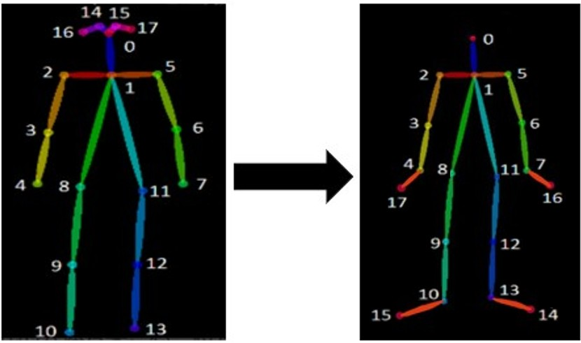
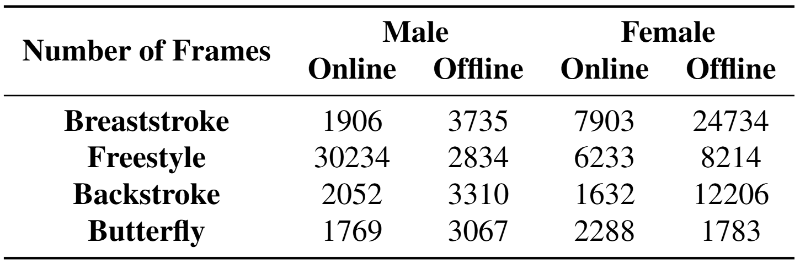

# A Large Scale Annotated Dataset For 2D Human Pose Estimation In Underwater Scenes
Dataset repository for the paper: **A Large Scale Annotated Dataset and Efficient Method for 2D Human Pose Estimation in Underwater Scenes** **(insert author list)**

**(insert paper link on arXiv)**

## Introduction
A `100K` scale annotated dataset for human pose estimation in underwater scenes, containing **(insert number)** image sequences (frames from videos of swimming) of `male` and `female` swimmers, covering a variety of swimming strokes(`breaststroke`, `freestyle`, `backstroke` and `butterfly`) as well as external environment factors like light condition and water quality.

## Structures
The main folder `dataset` contains **(insert number)** subfolders named from `1` to **(insert number)**. Each folder contains two subfolders 'images'(video frames of swimming, `jpg` or `png` format) and 'annots'(information about `18 keypoints` and `bounding box` of swimmers' body, in `json` file format) 

```
dataset/
|--1/
|  |--images/
|  |     |--image0
|  |     |--image1
|  |     |...
|  |--annots/
|  |     |--json0
|  |     |--json1
|  |     |...
|--2/
|...
|--**(insert number)**/
```
Each `json` file contains following parts:

```json
{
    "filename": "path to related image file",
    "height": in pixels,
    "width": in pixels,
    "scaleratio": scale ratio of related image file,
    "annots": [
        {
            "personID": always 0(since we focus on single swimmer's pose),
            "bbox": [
                x coordinate of up left dot,
                y coordinate of up left dot,
                x coordinate of down right dot,
                y coordinate of down right dot
            ],
            "keypoints": [
                [
                    x coordinate of keypoint 0(nose),
                    y coordinate of keypoint 0(nose),
                    visibility of keypoint 0(nose)(1.0 denotes "visible" while 0.0 denotes "invisible", which means occluded by water surface)
                ],
                [
                    x coordinate of keypoint 1(neck),
                    y coordinate of keypoint 1(neck),
                    visibility of keypoint 1(neck)(1.0 denotes "visible" while 0.0 denotes "invisible", which means occluded by water surface)
                ],
                ... ...
                [
                    x coordinate of keypoint 17(right finger),
                    y coordinate of keypoint 17(right finger),
                    visibility of keypoint 17(right finger)(1.0 denotes "visible" while 0.0 denotes "invisible", which means occluded by water surface)
                ]
            ]
        }
    ],
    "detect_feet": true or false,
    "isKeyframe": true or false
}
```

## Setup
We use both **online** and **offline** data collection methods, and the sample images collected are shown below. At the level of **network collection**, we obtain relevant public data, most of which are videos of professional athletes competing and teaching, including relatively standard various swimming strokes. At the **offline acquisition** level, we use two *Go Pro* waterproof cameras to capture videos of ordinary people swimming in an indoor swimming pool. 

**Sample data collected online**


**Sample data collected offline**


## Annotations
In order to help determine the swimming style and improve the prediction accuracy, we add the finger and toe keypoints on both sides to **MS COCO** keypoints format, which means ends of middle fingers of both hands and ends of middle toes of both feet. At the same time, we also remove four redundant keypoints, eyes and ears of both sides, which do not contribute much to the pose estimation task. The scope of annotation is limited to the visible keypoints in the image, and the invisible ones (occluded by water) are not annotated to reduce the impact of noise on model training. At the same time, to ensure the high accuracy of object detection, we manually label the detection boxes for training object detectors.

**Skeleton for annotation**



**List of keypoints in our annotation strategy**

| ID | Name | ID | Name | ID | Name |
|----|------|----|------|----|------|
|  0 | nose | 6  | left_elbow | 12 | left_knee |
|  1 | neck | 7  | left_wrist | 13 | left_ankle |
|  2 | right_shoulder | 8 | right_hip | 14 | left_toe |
|  3 | right_elbow | 9 | right_knee | 15 | right_toe |
|  4 | right_wrist | 10 | right_ankle | 16 | left_finger |
|  5 | left_shoulder | 11 | left_hip | 17 | right_finger |

**Sample annotated image in our dataset**


## Statistics

The dataset contains **(insert number)** image sequences formed by video frames of swimming. Each video corresponds to a specific stroke. To enrich the gender diversity of the data, we collect data for both male and female swimmers. 

Here we make a detailed information list about swimmer's gender, length, swimming stroke and source of each image sequence. 

| Name | Number of Frames | Swimming Stroke | Gender | Source |
|------|------------------|-----------------|--------|--------|
| 1 | 192 | breast | female | online |
| 2 | 4755 | free | male | online |
| 3 | 1898 | free | male | online |
| 4 | 1992 | free | male | online |
| 5 | 4123 | free | male | online |
| 6 | 3990 | free | male | online |
| 7 | 662 | breast | female | online |
| 8 | 711 | back | female | online |
| 9 | 631 | breast | female | online |
| 10 | 469 | breast | female | online |
| 11 | 294 | butterfly | female | online |
| 12 | 302 | butterfly | female | online |
| 13 | 297 | butterfly | female | online |
| 14 | 519 | free | male | online |
| 15 | 282 | unknown | male | online |
| 16 | 272 | unknown | male | online |
| 17 | 293 | butterfly | male | online |
| 18 | 344 | butterfly | male | online |
| 19 | 501 | butterfly | male | online |
| 20 | 511 | butterfly | female | online |
| 21 | 609 | breast | female | online |
| 22 | 554 | breast | female | online |
| 23 | 987 | free | male | online |
| 24 | 358 | breast | female | online |
| 25 | 669 | breast | female | online |
| 26 | 1459 | breast | female | online |
| 27 | 664 | breast | female | online |
| 28 | 340 | butterfly | male | online |
| 29 | 1194 | free | male | online |
| 30 | 268 | free | male | online |
| 31 | 4082 | free | male | online |
| 32 | 1776 | free | female | online |
| 33 | 714 | free | male | online |
| 34 | 432 | free | female | online |
| 35 | 495 | free | female | online |
| 36 | 1029 | free | female | online |
| 37 | 899 | free | female | online |
| 38 | 351 | back | female | online |
| 39 | 360 | butterfly | female | online |
| 40 | 705 | free | male | online |
| 41 | 602 | free | female | online |
| 42 | 439 | butterfly | female | online |
| 43 | 384 | butterfly | female | online |
| 44 | 450 | breast | male | online |
| 45 | 440 | free | female | online |
| 46 | 894 | breast | male | online |
| 47 | 631 | butterfly | male | online |
| 48 | 314 | back | female | online |
| 49 | 378 | free | male | online |
| 50 | 256 | back | female | online |
| 51 | 407 | free | female | offline |
| 52 | 394 | back | female | offline |
| 53 | 477 | breast | female | offline |
| 54 | 144 | butterfly | female | offline |
| 55 | 1585 | breast | female | offline |
| 56 | 721 | back | male | online |
| 57 | 630 | back | male | online |
| 58 | 562 | breast | male | online |
| 59 | 543 | free | male | online |
| 60 | 2188 | back | female | offline |
| 61 | 4090 | breast | female | offline |
| 62 | 2907 | free | female | offline |
| 63 | 3310 | back | male | offline |
| 64 | 3067 | butterfly | male | offline |
| 65 | 2020 | breast | male | offline |
| 66 | 2247 | breast | female | offline |
| 67 | 4982 | breast | female | offline |
| 68 | 2440 | back | female | offline |
| 69 | 6967 | breast | female | offline |
| 70 | 4426 | free | female | offline |
| 71 | 7552 | back | female | offline |
| 72 | 1717 | breast | male | offline |
| 73 | 1718 | back | female | offline |
| 74 | 268 | free | male | offline |
| 75 | 213 | butterfly | female | offline |
| 76 | 1426 | butterfly | female | offline |
| 77 | 2566 | free | male | offline |

The average length of all image sequences is  **(insert number)** frames, and the standard deviation is **(insert number)** frames. Statistics on stroke, swimmer gender and data source could be seen in the table below. 



## Citing
If you find this dataset useful for your research, please consider citing the following paper:

**(insert bibtex citation code)**


